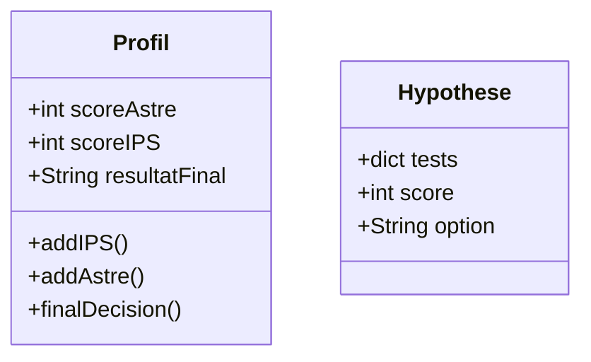

# ASTREOuIPS
programme qui exploite des données récoltés auprès des étudiants de 3ème année pour déterminer leur option

```mermaid
classDiagram
      class Profil{
            +int scoreAstre
            +int scoreIPS
            +String resultatFinal
            +addIPS()
            +addAstre()
            +finalDecision()
      }
      class Hypothese{
            +dict tests
            +int score
            +String option
      }
```
