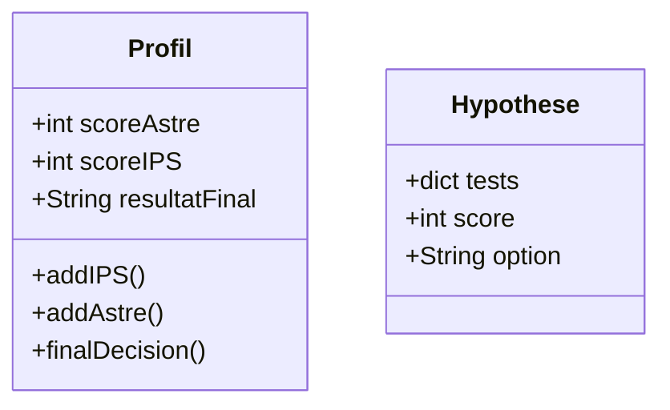
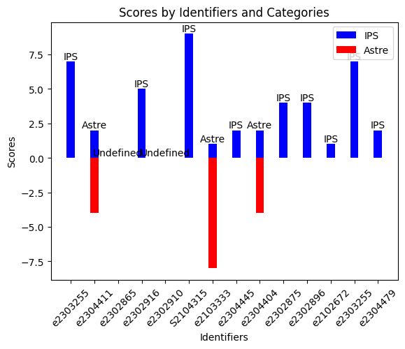

# ASTREOuIPS
programme qui exploite des données récoltés auprès des étudiants de 3ème année de l'ENSIM pour déterminer leur option
# Installation
Pour installer le programme il suffit de cloner le dépôt git et d'installer les dépendances avec pip:
```bash
git clone https://github.com/dinoclier72/ASTREOuIPS.git
cd ASTREOuIPS
pip install -r requirements.txt
```
ensuite vous serrez libre de traiter le fichier data.csv en lançant le script engine.py puis le script graph.py pour avoir un affichage graphique des résultats.
# Principe
# Fonctionnement
Pour mon fonctionnement j'ai décidé d'utiliser un système de classe pour stocker à la fois les réultats sous forme de profils, qui seront ensuite extrait sous forme de json avec le script engine.py pour être ensuite traité par le script graph.py qui va générer un graphique des résultats.

l'avantage d'un tel système est que pour formuler une hypothèse, il suffit de l'ajouter à la liste des hypothèse avec un simple ajout dans le code comme ceci:
```python
#hypothèse 1: C + arduino = AStre (3points)
allHypothese.append(Hypothese({1:"C",4:"Arduino"},3,"Astre"))
```
le dictionnaire prend en indice le numéro de la question et en valeur la réponse attendu, en cas de plusieur réponse attendue, il faut les spéarer par une , dans la valeur. Et pour une valeur qui ne doit pas être présente, il faut commencer par un !.
# Premiers résultats
J'ai utilisé les données que j'avais à ma disposition ainsi que les hypothèses suivantes:
1. C + arduino = AStre (3points)
2. construction dans minecraft + uX/UI = IPS (3 points)
3. étranger = IPS (1 point)
4. pc portable only ou pas de sac à dos IPS (1 point)
5. redstone dans minecraft + domotique/robotique = astre (4 points)
6. creation de contenu + proche de l'utilisateur = IPS (4 points)
7. ENSIMERSION + UX/UI = IPS (2 points)
8. démonté quelque chose + domotique/robotique = astre (4 points)

Ce qui donne un résultat comme celui-ci:

Les premières hypothèses ont comme problème que certains étudians n'ont pas beaucoup de point pour une matière ou l'autre ainsi que d'autre ne correspondent à aucune de mes hypothèses formulée. Ce qui demande un réiquilibrae des poids de chaque hypothèse ainsi qu'un ajout de nouvelle hypothèses plus étendue.
