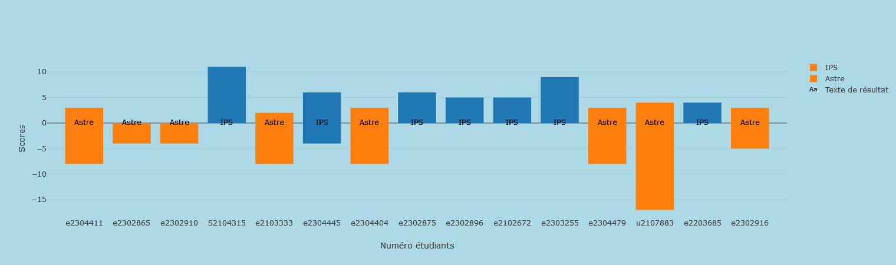

# ASTREOuIPS
# Principe
Ce projet se base sur l'analyse d'un corpus de données recueillies auprès d'élèves de 3ème année informatique de l'ENSIM (École Nationale Supérieur des Ingénieurs du Mans), afin de déterminer si les élèves sont plus attirés par la filière ASTRE (Architecture des Systèmes Temps Réel Embarqués) ou IPS (Interaction Personne Système).
Pour avoir notre corpus nous avons créé un questionnaire de 17 questions:
1. Quel est ton numéro étudiant ? (eXXXXXX, iXXXXXX ...)
   - Reponse courte
2. Quel est ton langage de programmation préféré ?(choix unique)
   - C
   - Java
   - JavaScript, HTML, CSS
   - C++
   - kotlin/dart
   - C#
3. Ton OS (système d'exploitation) :(choix multiple)
   - linux
   - windows
   - mac OS
   - chrome OS
4. Quelle terminologie te parle le plus ?(choix multiple)
   - Domotique
   - UX/UI
   - Frontend / Backend
   - Robotique
5. Parmi ces différentes technologies, avec lesquelles as-tu déjà expérimenté pendant ton temps libre ? (choix multiple)
   - VR/AR
   - Arduino
   - Intelligence Artficielle
   - Moteurs de jeux vidéo
   - Aucune
6. As-tu déjà démonté / monté un appareil électronique ?(choix multiple ave option de texte court)
   - PC
   - Téléphone
   -  Non
   -  Autre...
7. Qu'est-ce que tu aimes le plus faire dans Minecraft ?(Choix unique)
   - La redstone
   - La construction
   - je ne joue pas/je ne connais pas
8. Quelles étaient tes deux spécialités au bac (ou celle qui y ressemble le plus) ? (choix multiple)
   - Sciences de l'ingénieur (SI)
   - Mathématiques
   - Numérique et sciences informatiques
   - Physique-chimie
   - Sciences de la vie et de la Terre (SVT)
   - Biologie, écologie
   - Arts : histoire des arts, théâtre, arts plastiques, arts du cirque, cinéma-audiovisuel, danse, musique
   - Éducation physique, pratiques et culture sportives
   - Histoire géographie, géopolitique et sciences politiques
   - Humanités, littérature et philosophie
   - Langues, littératures et cultures étrangères et régionale
   - Littérature et langues et cultures de l'Antiquité
   - Sciences économiques et sociales (SES)
   - J'ai fait un BAC techno
9.  Quelles associations de l'ENSIM as-tu rejoins ? (choix multiple)
    - BDE
    - CULTU
    - K'verne
    - ENIGMA
    - ENSIMERSION
    - ENSIM'ELEC
    - GALA
    - Les trublions du plateau
    - MAO
    - VASI
    - Aucune
10. Quelle association de couleurs te paraît la plus harmonieuse ?(Choix parmis quatres images)
11. Quels sont les IDE (environnement de développement) que tu as déjà utilisé ? (choix multiple)
    - VSCode
    - Vim
    - La suite JetBrains (IntelliJ, PyCharm ...)
    - Code::Blocks
    - NetBeans
    - La suite anaconda (Jupyter ...)
12. Est-ce que tu es à l’aise pour travailler en contact avec les utilisateurs ? (échelle de 0 à 9)
13. Quelle était ta matière préférée au lycée ? (choix unique)
    - Histoire - Géographie
    - EPS
    - Français
    - Mathématiques
    - Physique-Chimie
14. Ton environnement de travail plus tard : (choix unique)
    - Freelance (Indépendant)
    - PME / Startups
    - Grande entreprise, grand groupe
    - Laboratoire de recherche
15. Qu’est ce qui t’attire dans l’informatique? (choix unique)
    - Résoudre des problèmes avec du code
    - Créer du contenu
    - Manager
    - La cyber-sécurité
16. De quel pays viens-tu ? (choix unique)
    - Brésil
    - Cameroun
    - Côte d'Ivoire
    - France
    - Maroc
    - Tunisie
17. Quelle est la plus grande priorité en informatique pour toi ? (choix unique)
    - L’esthétique
    - Le fonctionnel
    - La sécurité
18. Tu mettrais quoi dans ton sac à dos ? (choix unique)
    - Un tournevis, c'est toujours utile
    - Papier, crayon, trousse, la base
    - Mon pc portable only 
# Installation
Pour installer le programme il suffit de cloner le dépôt git et d'installer les dépendances avec pip, ensuite vous pouvez lancer le programme avec python.
```bash
git clone https://github.com/dinoclier72/ASTREOuIPS.git
cd ASTREOuIPS
pip install -r requirements.txt
python dashboard.py
```
# Fonctionnement
Pour mon fonctionnement j'ai décidé d'utiliser un système de classes pour stocker à la fois les résultats sous forme de profils, qui seront ensuite extraits sous forme de json avec le script engine.py pour être ensuite traité par le script dashboard py qui va générer un graphique des résultats.

l'avantage d'un tel système est que pour formuler une hypothèse, il suffit de l'ajouter à la liste des hypothèses avec un simple ajout dans le code comme ceci:
```python
#hypothèse 1: C + arduino = AStre (3points)
Hypothese({1:"C",4:"Arduino"},3,"Astre")
```
Ou sinon nous pouvons éditer la liste d'hypothèse dans le fichier hypothese.json
```json
{
      "tests": {
            "1": "C",
            "4": "Arduino"
      },
      "score": 3,
      "option": "Astre"
}
```
le dictionnaire prend en indice le numéro de la question et en valeur la réponse attendu, en cas de plusieur réponse attendue, il faut les spéarer par une , dans la valeur. Et pour une valeur qui ne doit pas être présente, il faut commencer par un !.

Enfin le dashboard est construit avec à la librairie dash, qui permet de contruire une page internet à partir de mes scripts python.
# Utilisation
## Premiers résultats
J'ai utilisé les données que j'avais à ma disposition ainsi que les hypothèses suivantes:
1. C + arduino = AStre (3points)
2. construction dans minecraft + uX/UI = IPS (3 points)
3. étranger = IPS (1 point)
4. pc portable only ou pas de sac à dos IPS (1 point)
5. redstone dans minecraft + domotique/robotique = astre (4 points)
6. creation de contenu + proche de l'utilisateur = IPS (4 points)
7. ENSIMERSION + UX/UI = IPS (2 points)
8. démonté quelque chose + domotique/robotique = astre (4 points)

Ce qui donne un résultat comme celui-ci:


Les premières hypothèses ont comme problème que certains étudiants n'ont pas beaucoup de points pour une matière ou l'autre ainsi que d'autres ne correspondent à aucune de mes hypothèses formulée. Ce qui demande un rééquilibre des poids de chaque hypothèse ainsi qu'un ajout de nouvelle hypothèse plus étendue.
## Résultats finaux
Suite à ces observations j'ai mis en place de nouvelles hypothèses et est résolu un bug qui empêchait certaines hypothèses d'être reconnu. Les hypothèses sont les suivantes:
1. C + arduino = AStre
2. construction dans minecraft + uX/UI = IPS
3. étranger = IPS
4. pc portable only ou pas de sac à dos IPS
5. redstone dans minecraft + domotique/robotique = astre
6. creation de contenu + proche de l'utilisateur = IPS
7. ENSIMERSION + UX/UI = IPS
8. démonté quelque chose + domotique/robotique = astre 
9. aime la robtique et le fonctionnel = ASTRE
10. connait le frontend/backend et aime l'estétique = IPS


Avec ces nouvelles hypothèses, nous avons un résultat qui touche plus de personnes, il restera juste à trouver les poids idéaux pour chaque hypothèse.


Avec un équilibrage des poids, nous pouvons voir que les résultats sont plus équilibrés et que les personnes qui ne correspondaient à aucune hypothèse sont maintenant réparties entre les deux filières.